---
title: Demystifying TLS
date: '2021-05-30'
description: We provide an overview of TLS and demystify the TLS Handshake Protocol using Wireshark
--- 

I recently had to prepare a presentation on TLS as part of the cybersecurity class I was taking. Researching and understanding TLS took quite some effort. However, I was quite satisfied with the things I had learned. In this blog post, I wanted to document the things I understood, as well as try to answer some of the questions I asked myself while preparing my presentation.

*Before reading, I strongly recommend you read a little about asymmetric/symmetric encryption, message authentication code (MAC), and digital certificates. I don't believe you need extensive background in those topics, but exposure will definitely help. I am personally not an expert in any of those topics and doubt i'd be able to do a better job than what's already available out there.*

## What's so special about this article?

Not much. All the information you'll find here is already available on the internet. However, it's been a bit challenging for me to compile that information and connect the dots. For me, this article is simply what I wish I found when I was researching the topic. 
## Motivation of TLS

Before talking about what Transport Layer Security (TLS) is, let's briefly introduce why it exists in the first place. The overarching objective is to set up a secure communication channel over internet which guarantees confidentiality, integrity, and authenticity. 

TLS tells us **how** to set up such a secure channel. It tells us the exact steps a client/server should follow to set it up. Concepts such as asymmetric/symmetric encryption, digital signatures, MACs, etc. are our building blocks, and TLS fits them together to achieve its overarching goal. 

## Brief Evolution of TLS

I won't get into much detail here. This is mainly to clear up any confusion between SSL and TLS. People have developed a tendency to use both interchangeably, but the two have significant technical differences. 

First, TLS 1.0 (the first version) deprecated SSL 3.0 (the last SSL version). Both protocols actually work towards the same goal, except that multiple vulnerabilities were discovered in SSL, which logically led to its deprecation. Actually, even the first two iterations of TLS (TLS 1.0 & TLS 1.1) are now considered deprecated. Major browsers have announced lately that they don't plan on supporting them in the future. I found a pretty cool illustration from the GlobalSign blog that summarizes the evolution of TLS.

### Relationship with SSL/TLS certificates

This is also one thing I wish to clear up. If SSL and TLS certificates are two different protocols, does that mean that when we acquire an SSL certificate, we have to use SSL and not TLS? Absolutely not. You might (and should) be using TLS, yet certificate registration providers will likely refer to your digital certificate as an SSL certificate. I believe this is just a name that stuck around for the longest time. More providers are starting to use the term SSL/TLS certificate, but it still a little bit confusing. 

The point is: the certificate does **NOT** determine the protocol. The way everything fits together is that digital certificates are used **WITH** TLS or SSL. 

TLS or SSL is the protocol. The certificate is just a means to prove the authenticity of the public key and can be used with both TLS and SSL irrespective of what they're being called by others/certificate registration providers. 

### The TLS Protocol

One of the first descriptions of TLS you'll come across is: "TLS is a layered protocol". It is comprised of 2 layers. The first (lower) layer is for the Record Protocol. The second (upper) layer is for one of the following 4 protocols: the handshake protocol, the alert protocol, the change cipher spec protocol, the heartbeat protocol and the application data protocol. 

The Record Protocol, by being the lower layer, abstracts some functionality from the upper layer. It's quite similar to how IP provides a service (e.g. routing, addressing) for TCP and UDP. In the context of TLS, the Record Protocol can fragment, apply a MAC, encrypt, or/and optionally compress data. At the receiving end, it can reassemble, verify, decrypt, or/and optionally decompress data. 

The upper layer protocols are used for different purposes, mainly, negotiating encryption algorithms/secrets and providing some error control. 

The layered approach abstracts behavior and provides services to the upper layer. The motivation behind this layered approach is similar to what you might be familiar with in the case of the TCP/IP and OSI models: modularity, decoupling, re-use, etc.

## Terminology

Before talking more detail, I want to introduce some terminology. I think it will help in our discussion and in case you read other more technical articles.

TLS, as a protocol, exchanges messages and in the context of TLS, we usually call those **records**. Each record contains a specific set of common fields + some other fields depending on what is used in the upper layer. These "other fields" depend mainly on the value of the content type field (which is found in all TLS records). Below is a representation of a TLS record. 

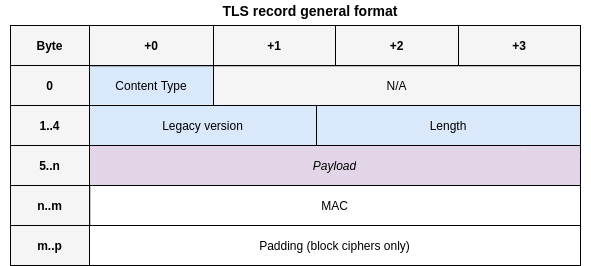

This diagram is abstract. Can you guess why?

The reason is because the "Payload" on the above diagram doesn't really mean anything... The payload will depend on what the content type field value is. However, the key takeaway here is that every TLS record will have **at least** the fields specified above. 

## TLS Content Types

As mentioned previously, there are different values for the content type field. Each conforms to a specific 2nd layer protocol. Our focus will be mainly on the first 3, but I thought it would be nice to provide at least a short description for each protocol. 

- **Handshake**: used to exchange the necessary information required by the client and the server to start encrypting the application data
- **ChangeCipherSpec**: used to change the encryption strategy/algorithm being used by the client and server
- **Application Data**: used to refer to the messages we get from the application layer (e.g. an HTTP request or response). The messages are carried by the Record Protocol and are basically treated as transparent data.
- **Alert**: used to signal an error or a warning
- **Heartbeat**: used to test and keep alive the secure communication

Now, with the background we have acquired, we can go back to the previous TLS record format, and provide some more detail.

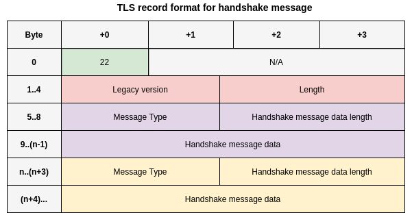

Scroll back up and try to compare the two record structures. 

Note the absence of the abstract "payload". Instead, because this is a handshake record (note the 22 value in the content type field), we have additional fields such as message type and handshake message data length.

## TLS Handshake

The TLS handshake is the series of TLS records exchanged by a client and a server to establish a secure communication. I enjoyed reading about this topic because it captures how everything fits together. If you ever asked yourself how a TLS session is established when you navigate to [https://google.com](https://google.com), this answers it. 

First, we'll briefly talk about the TLS handshake steps, then, at each step, we'll make use of wireshark so that we can see things in practice.

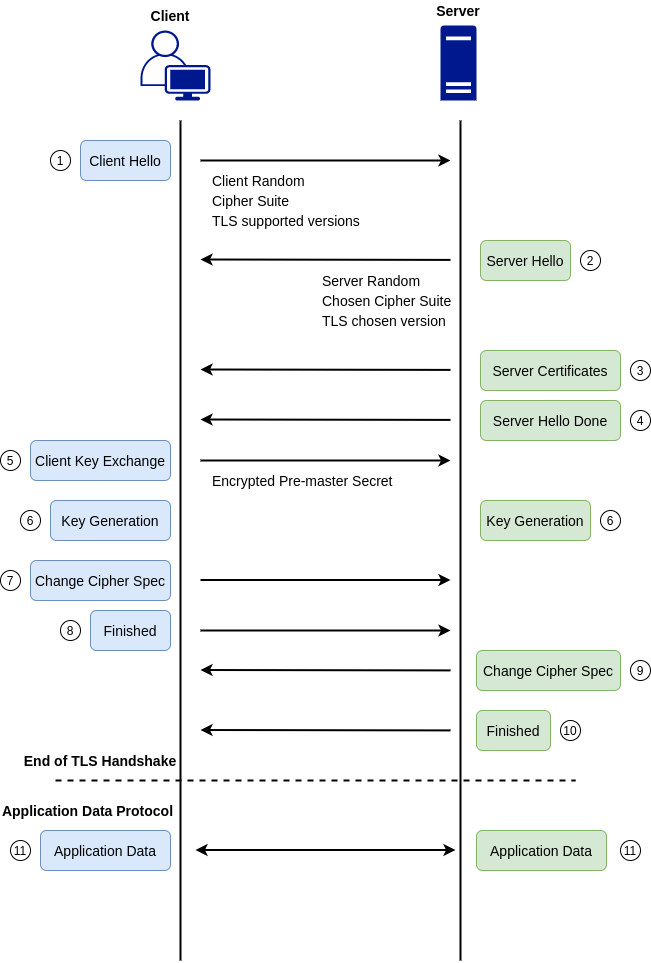

### Step 1: Client Hello

The client initiates the handshake by sending a Client Hello message to the server. The TLS record will include, among other things, the supported TLS versions and a string of random bytes known as the **client random**. The client random is simply a set of random bytes. We'll see how it is used later. The supported **cipher suite** is also sent from the client. A cipher suite is just a set of cryptographic algorithms that can be used to encrypt the communication channel. 

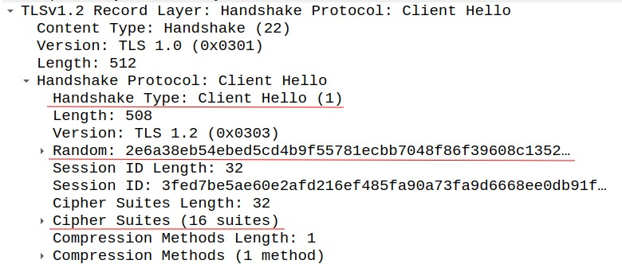

Let's take a closer look at the cipher suites field

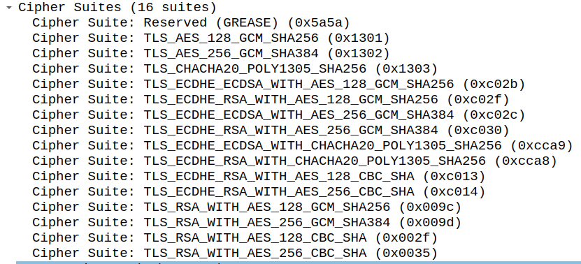

We'll take **TLS\_RSA\_WITH\_AES\_256\_CBC\_SHA** as an example and try to parse it:

- **RSA**: Refers to the algorithm used for the key exchange. As we'll see later, our client will generate a premaster secret and will have to send it to the server. The premaster secret is a sensitive piece of information. In order to guarantee its confidentiality, an encryption algorithm needs to be used. If the server chooses the cipher suite we took as an example, it will use RSA to encrypt the premaster secret.
- **AES\_256\_CBC**: Refers to the symmetric-key algorithm used to encrypt the session data
- **SHA**: Refers to the MAC algorithm used.

### Step 2: Server Hello

The server will respond with a Server Hello message. It will include the server's chosen cipher and TLS version, as well as a **server random**. 

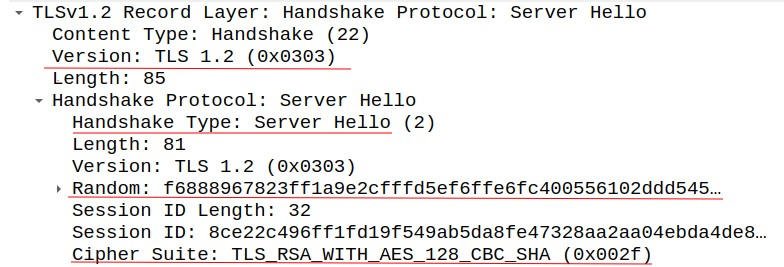

### Step 3: Server Certificates

The server will send its certificate chain for the client to verify. 

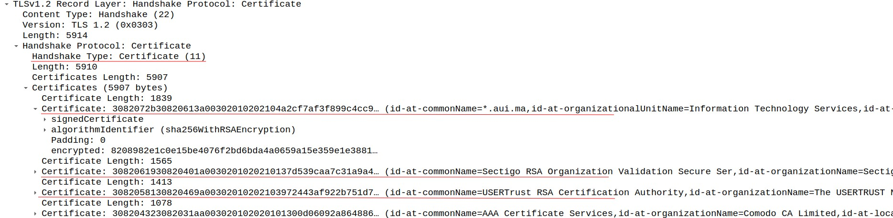

### Step 4: Server Hello Done

The server sends this message to signal the completion of the hello-message phase of the handshake. In other words, when a client receives this message, it should know that the server is done sending messages. The client should now verify the server certificate and move on to the next step.

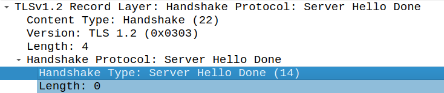

### Step 5: Client Key Exchange

This is the beginning of a new phase, the client key exchange phase. The client will generate one more string of random bytes referred to as the **premaster secret**. The public key of the server, which the client should have authenticated by verifying the server certificate, is used to encrypt the premaster secret. Only the server should be able to decrypt the premaster secret because only it has the private key. 

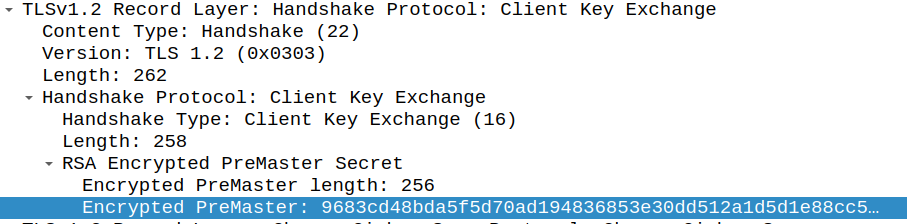

### Step 6: Key Generation

At this level, both the client and server have enough information to generate session keys. The server random, client random, and premaster secret will be used to generate the session keys. 

### Step 7: Change Cipher Spec Message

This message is sent to instruct the server that subsequent TLS records will use another encryption mode. In this case, we switch from asymmetric to symmetric encryption.

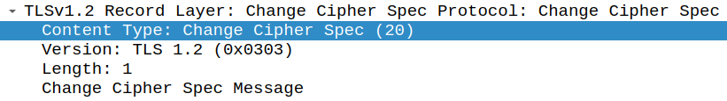

**Why is the CipherSpecMessage part of the CipherSpecProtocol and not a simple message part of the Handshake Protocol?**

Think about it. Can't we just include a boolean that says either yes or no for switching the encryption mode as part of a some Handshake message?

I think the answer to these questions boils down to a design decision that was once made when defining the TLS Protocol. Actually, I have not mentioned this previously, but many TLS messages can be batched into one TLS Record, **as long as they belong to the same 2nd layer protocol**. This means that one or more TLS Handshake messages can be sent as part of one TLS record. The problem is that encryption is performed at the record level! 

Imagine sending a message to the server, saying, "hey, please switch to the new encryption mode", but then, this same message + potentially other messages are encrypted using the **new** encryption mode .. which the server does NOT expect. 

The fact that the ChangeCipherSpec message is part of its own protocol (the ChangeCipherSpec protocol) breaks this batching. Now implementations are forced to start a new TLS Record when new encryption settings are set! This is particularly relevant in the next step because the subsequent TLS message will now be encrypted using the new settings, and the server would expect that (because it would have received a ChangeCipherSpec message).

### Step 8: Finished

The finished message is the first message that is encrypted using the newly negotiated algorithms, keys, and secrets. It should be sent right after the ChangeCipherSpec message.

The receiving end must verify that its contents are correct. In fact, this is quite a crucial step, because it allows the receiving end to verify that the authentication and key exchange processes were successful and not tampered with. Remember, an active man-in-the-middle should be able to tamper with the Client Hello, Server Hello, and other non-encrypted TLS Handshake messages. The Finished message includes a hash over unencrypted handshake messages (e.g. ClientHello, ServerHello). 

When a party receives the Finished message, it decrypts it using the session key, then computes a hash over all the previous handshake messages it received (all are kept up until this point), then it compares this hash with the hash that was sent as part of the Finished message.

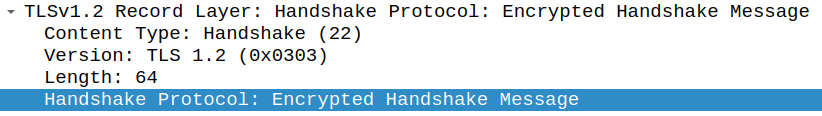

### Step 9 and 10: Change Cipher Spec and Finished Messages

Similar to steps 7 and 8, except that this is sent from the server to instruct that the messages from the server to the client will use new encryption settings. The Finished message in this case is sent for the client to validate the newly negotiated algorithms, keys, and secrets. 

This is the last step in the Handshake Protocol.

### Step 11: Application Data

Now that the server is authenticated and the encryption algorithm + keys are negotiated, we are ready to start sending and receiving encrypted application-layer data: https in our example.

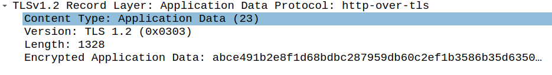

## Conlusion

I hope this has been somewhat helpful. Truth be told, TLS is a new topic for me. I had been exposed to it in the past and have even set up an HTTPS server, but I never really knew the details of how the session key is generated or how digital certificates are sent from the server to the client. 

There is still much to talk about in TLS, but I feel like, for now, this answered most of the questions I had when I first read about the topic. Feel free to zoom in on each part and read more about the various protocols. The goal of this article, from a reader perspective, was to expose you to TLS.
